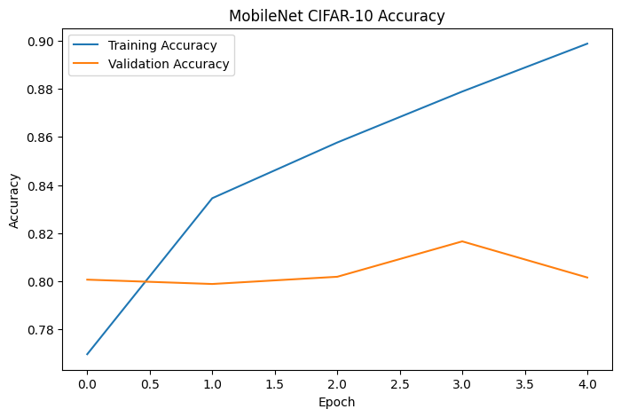
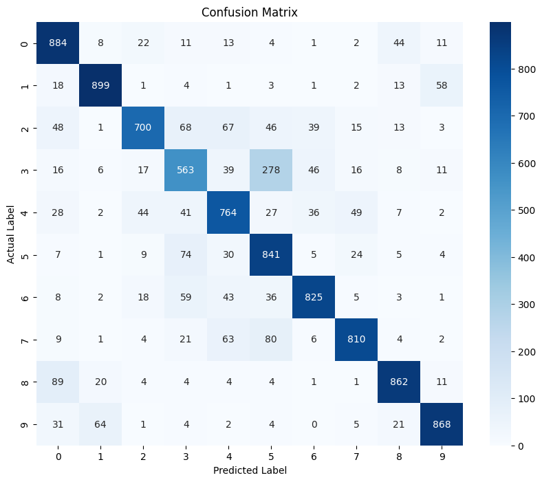
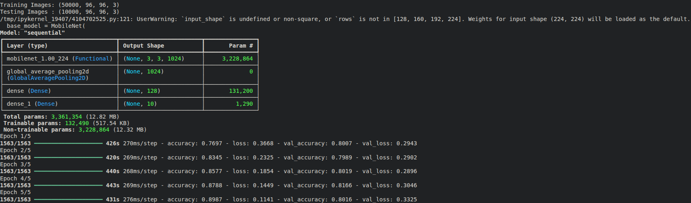
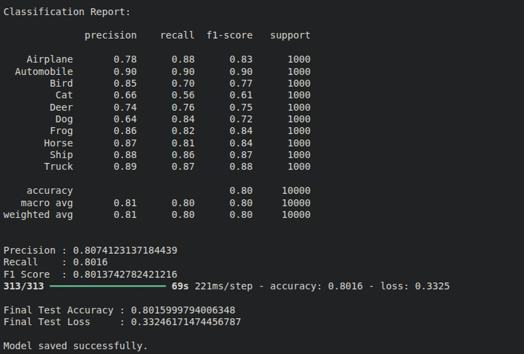

# 🚀 MobileNet-Based CIFAR-10 Image Classification with Custom Hybrid Loss Function


---

## 📖 Introduction

Image classification is one of the most important applications of Deep Learning and Computer Vision. In this project, we developed an image classification system using the CIFAR-10 dataset and a pre-trained MobileNetV1 architecture.

Instead of using the standard categorical cross-entropy loss function, we designed a **Custom Hybrid Loss Function** that combines **Focal Loss** and a **Confidence Penalty**. This helps the model focus on difficult samples while reducing overconfident predictions.

The project demonstrates concepts such as:

- Transfer Learning
- CNN-based Image Classification
- Custom Loss Function Design
- Model Evaluation using Precision, Recall and F1-Score
- Visualization using Accuracy Curves and Confusion Matrices

---

# 📂 Dataset

The project uses the **CIFAR-10 Dataset**.

| Property | Value |
|----------|--------|
| Training Images | 50,000 |
| Testing Images | 10,000 |
| Classes | 10 |
| Image Size | 32 × 32 × 3 |
| Dataset Type | RGB Images |

### Classes

- Airplane
- Automobile
- Bird
- Cat
- Deer
- Dog
- Frog
- Horse
- Ship
- Truck

---

# ⚙️ Data Preprocessing

Before training, the dataset undergoes several preprocessing steps:

### 1. Normalization

Pixel values are scaled from:

```text
0 – 255
```

to

```text
0.0 – 1.0
```

This improves numerical stability during training.

### 2. One-Hot Encoding

Class labels are converted into one-hot encoded vectors using:

```python
to_categorical()
```

### 3. Image Resizing

Since MobileNet requires larger inputs than CIFAR-10's native resolution, images are resized from:

```text
32 × 32 × 3
```

to

```text
96 × 96 × 3
```

using TensorFlow's image resizing utilities.

---

# 🏗️ Model Architecture

The project uses **MobileNetV1** with ImageNet pretrained weights.

### Architecture Pipeline

```text
Input Image (96 × 96 × 3)
            │
            ▼
      MobileNetV1
   (ImageNet Weights)
            │
            ▼
 GlobalAveragePooling2D
            │
            ▼
     Dense Layer (128)
          ReLU
            │
            ▼
     Dense Layer (10)
        Softmax
            │
            ▼
       Prediction
```

### Transfer Learning Strategy

- Pretrained MobileNet weights are loaded.
- Convolutional layers are frozen.
- Only classification layers are trained.
- Reduces training time.
- Improves generalization.

---

# 🧠 Custom Hybrid Loss Function

One of the key contributions of this project is the implementation of a **Custom Hybrid Loss Function**. Instead of relying solely on Categorical Cross-Entropy, the model combines **Focal Loss** with a **Confidence Penalty** to improve learning efficiency and generalization performance.

## Why a Custom Loss Function?

Standard Cross-Entropy Loss focuses primarily on maximizing classification accuracy. However, it often suffers from:

- Overconfident predictions
- Reduced focus on difficult samples
- Poor generalization on ambiguous inputs

To address these limitations, a Hybrid Loss Function was designed by combining Focal Loss and Confidence Penalty.

---

## 1. Focal Loss Component

Focal Loss helps the model focus more on difficult and misclassified training examples.

### Formula

```text
FL(pt) = - α × (1 - pt)^γ × log(pt)
```

### Where

| Symbol | Meaning |
|----------|----------|
| pt | Predicted probability of the correct class |
| α | Class weighting factor |
| γ | Focusing parameter |

### Hyperparameters Used

```text
α = 1.0
γ = 2.0
```

### Advantages

- Reduces the influence of easy samples
- Focuses learning on difficult examples
- Improves feature extraction
- Produces better class separation

When a sample is classified correctly with high confidence, the value of `(1 - pt)` becomes very small, reducing its contribution to the loss. Misclassified samples therefore contribute more strongly during optimization.

---

## 2. Confidence Penalty Component

Neural networks frequently become overconfident during training and assign extremely high probabilities to a single class.

To reduce this behavior, a Confidence Penalty based on entropy is added.

### Entropy Formula

```text
H(p) = - Σ [ p(c) × log(p(c)) ]
```

### Confidence Penalty

```text
CP = -H(p)
```

### Where

| Symbol | Meaning |
|----------|----------|
| H(p) | Entropy of the prediction distribution |
| p(c) | Probability assigned to class c |
| CP | Confidence Penalty |

### Hyperparameter Used

```text
λ = 0.01
```

### Advantages

- Reduces overconfident predictions
- Encourages smoother probability distributions
- Improves robustness
- Helps prevent overfitting
- Improves generalization on unseen data

---

## Final Hybrid Loss Function

The final loss used during training combines both components:

```text
Hybrid Loss = Focal Loss + λ × Confidence Penalty
```

or equivalently

```text
Lhybrid = FL(pt) + λ × CP
```

For this project:

```text
Lhybrid = FL(pt) + 0.01 × CP
```

---

## Implementation Parameters

```text
Alpha (α)            = 1.0
Gamma (γ)            = 2.0
Lambda Penalty (λ)   = 0.01
```

---

## Benefits of the Hybrid Loss Function

The Hybrid Loss combines the strengths of both approaches:

### Focal Loss

✔ Focuses on hard examples

✔ Improves learning efficiency

✔ Handles difficult samples better

### Confidence Penalty

✔ Reduces overconfidence

✔ Produces smoother decision boundaries

✔ Improves model robustness

✔ Enhances generalization

As a result, the MobileNet model learns difficult CIFAR-10 classes more effectively while avoiding excessively confident predictions, leading to improved performance on unseen test data.

# 📊 Results

The model was trained on CIFAR-10 using MobileNet and the Custom Hybrid Loss Function.

### Final Performance

| Metric | Value |
|----------|----------|
| Test Accuracy | 80.15% |
| Test Loss | 0.3324 |

---

## Training Accuracy Graph



---

## Confusion Matrix



---

## Output 



---




---


# 👥 Team Contributions


### T. Harshavardhan 

- Dataset preparation
- CIFAR-10 analysis
- Data preprocessing
- Image normalization
- Image resizing pipeline

---

### Adelly Sai Teja 

- Custom Hybrid Loss design
- Focal Loss implementation
- Confidence Penalty implementation
- Hyperparameter tuning
- Loss optimization experiments

---

### B. Vignesh 

- MobileNet integration
- Transfer learning setup
- Model architecture design
- Model training
- Training optimization

---

### Darsi Praneeth Kumar

- Performance evaluation
- Precision, Recall and F1-score analysis
- Confusion matrix generation
- Visualization generation
- Documentation and reporting

---

# 💻 Installation

Clone the repository:

```bash
git clone https://github.com/your-username/MobileNet-CIFAR10.git
cd MobileNet-CIFAR10
```

Create virtual environment:

```bash
python -m venv venv
```

Activate environment:

### Linux / macOS

```bash
source venv/bin/activate
```

### Windows

```bash
venv\Scripts\activate
```

Install dependencies:

```bash
pip install -r requirements.txt
```

---

# ▶️ Running the Project

Execute:

```bash
python mobilenet_cifar10.py
```

The program will:

- Download CIFAR-10
- Preprocess images
- Train MobileNet
- Evaluate performance
- Generate confusion matrix
- Generate accuracy graphs
- Save trained model

---

# 💾 Saved Model

The trained model is stored as:

```text
mobilenet_cifar10_hybrid.keras
```

This allows:

- Reusing the trained network
- Making predictions without retraining
- Further fine-tuning in future work

---

# 🔮 Future Improvements

Possible future enhancements include:

- Fine-tuning MobileNet layers
- Data augmentation
- Hyperparameter optimization
- Testing EfficientNet and ResNet architectures
- Experimenting with different custom loss functions
- Increasing training epochs

---

# 📚 References

1. CIFAR-10 Dataset  
   https://www.cs.toronto.edu/~kriz/cifar.html

2. MobileNet Paper  
   https://arxiv.org/abs/1704.04861

3. TensorFlow Documentation  
   https://www.tensorflow.org

4. Focal Loss Paper  
   https://arxiv.org/abs/1708.02002

---

### Course Project

**Introduction to Computational Science**

MobileNet-Based CIFAR-10 Image Classification using a Custom Hybrid Loss Function.
